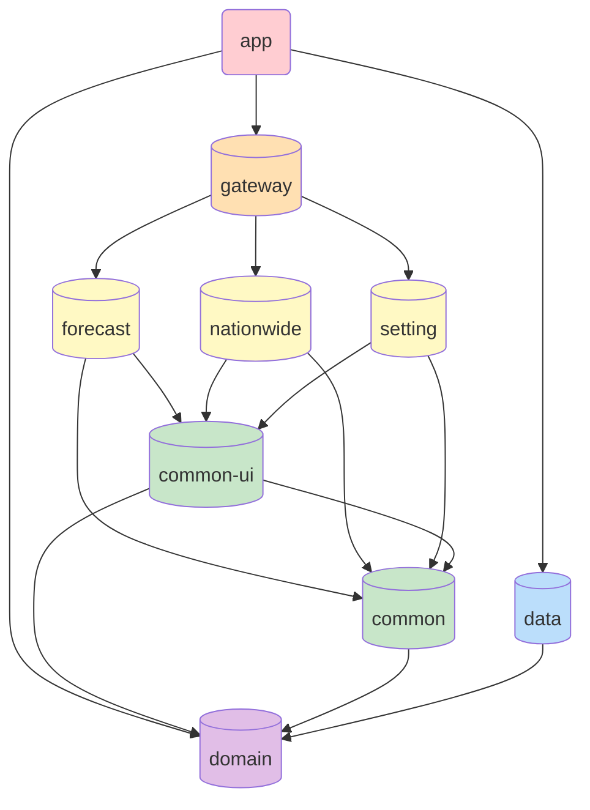

# suncloud

 
현재 위치한 지역의 기상 정보와 원하는 도시의 기상 정보를 제공합니다.

제공하는 기상 정보로 기온, 습도, 미세먼지, 24시간 날씨 정보, 1주일간 날씨정보 등을 제공합니다. 

</img>
</img>
</img>
</img>
</img>

## 개발환경 / Application Version
- Android Studio @Giraffe 2022.3.1
- minSdkVersion : 28
- targetSdkVersion : 34

## android tech
- language : Kotlin
- architecture : ACC MVVM
- di : Dagger-Hlit
- async library : RxJava
- network library : Retrofit2, Gson, OkHttp
- jetpack : Navigation Component, DataBinding, LiveData, DataStore, Paging3…

## 특징
- RxJava를 사용하여 비동기 프로그래밍을 구현
- ACC ViewModel을 사용해 ACC MVVM 디자인 패턴을 구현
- android jetpack을 최대한 활용

## APIs
- openweathermap api
  - https://openweathermap.org/current
  - https://openweathermap.org/api/air-pollution
 

- 공공데이터포털 api
  - https://www.data.go.kr/data/15084084/openapi.do
  - https://www.data.go.kr/data/15059468/openapi.do

## 모듈 구조

- **Suncloud (앱 모듈)**
  - 앱의 진입점
- **Gateway (게이트웨이 모듈)**
  - 메인 액티비티가 시작되는 곳 - GatewayActivity 
  - NetworkModule, RepositoryModule등 각종 Hilt 모듈로 의존성 설정
- **Forecast (기상 예보 모듈)**
  - ForecastFragment, ForecastViewModel
  - 현재 날씨, 24시간 날씨, 일주일간 날씨, 미세먼지 정보 등등
- **Nationwide (전국 기상 예보 모듈)**
  - NationWideFragment, NationWideViewModel
  - 전국 지도에 주요 도시 일기예보
- **Setting (설정 모듈)** 
  - SettingFragment, SettingViewModel
  - 유저들의 개인 설정 저장
- **Common** 
  - 피쳐의 공통기능 (ActivityLauncher, 각종 Base 등)
- **CommonUI**
  - 피쳐에서 공통적으로 사용할 UI에 관련된 모든 것 (Custom View, enum 등)
- **Data (데이터 모듈)** 
  - DTO, RepositoryImpl, DataSource 등
  - RepositoryImpl 에서 DTO 를 VO 로 변환
- **Domain (도메인 모듈)** 
  - VO, UseCase, RepositoryInterface 등
